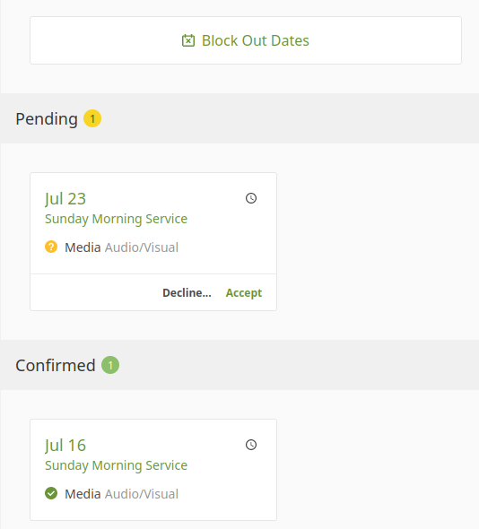
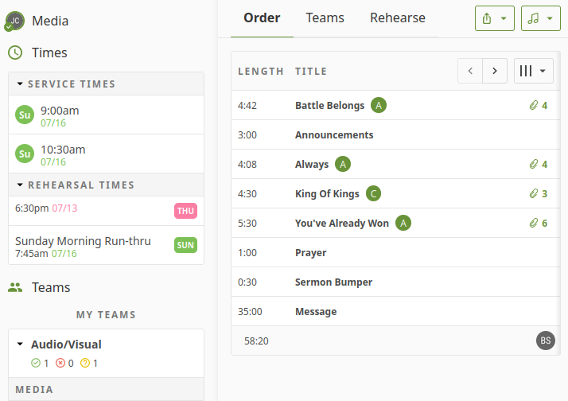

## Basic Instructions for Planning Center

### The Main Screen

One of the **most important** things to do is to use the **Block Out Dates** tool. When leaders build the schedule out, knowing who is and isn't available on a given week helps them to build a solid schedule, and prevents unnecessary last-minute changes.
You can also use the interface to accept or decline service times that have been assigned to you. *Promptly* respond to these, for the same reasons as above!

### Specific Services

Clicking on one of the services in your dashboard will open up that service's information, including:
    - Who else is serving that week
    - The order of service (what songs, communion, prayer, etc)
    - Service and rehearsal times

Clicking on any item in the **Order** will let you view associated information. Most of this is for the musicians, but the person running media will want to make note of the *arrangement* of each song, as these can change sometimes.